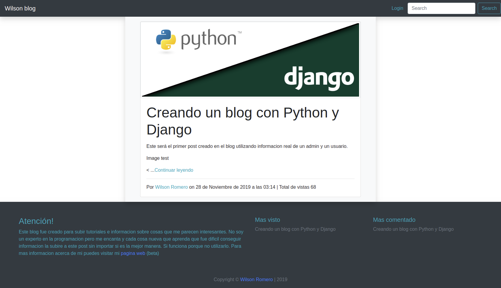
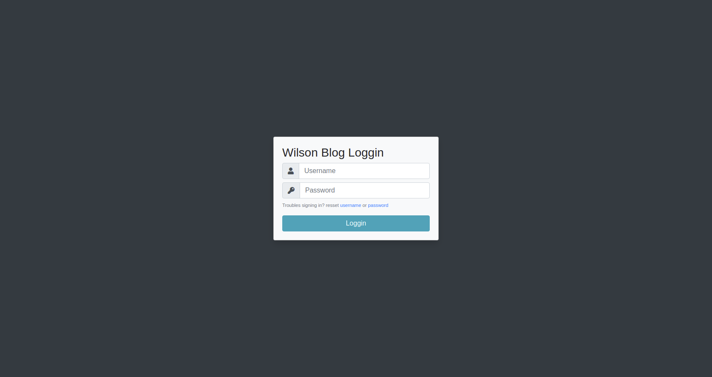
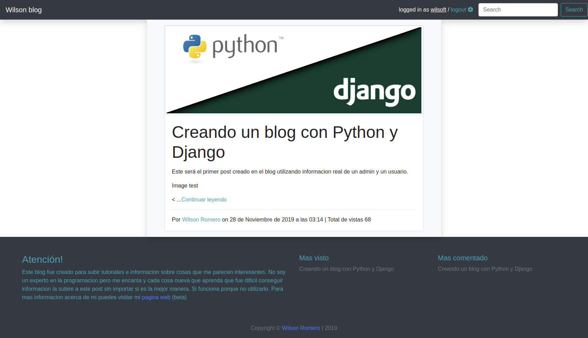
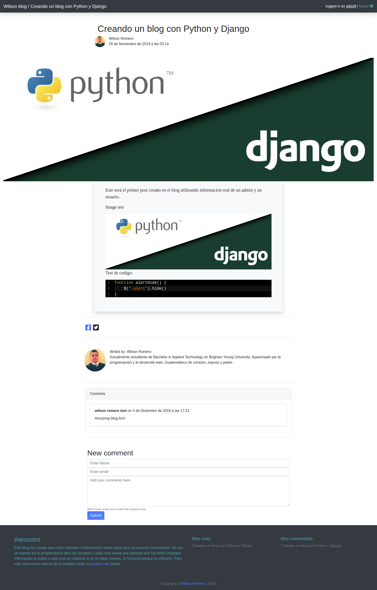
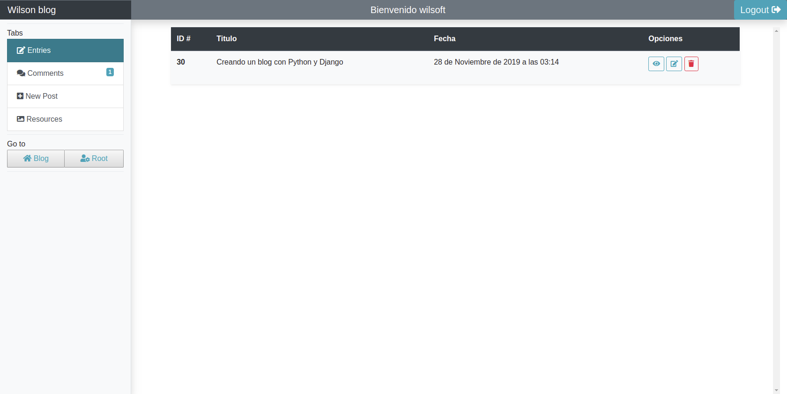
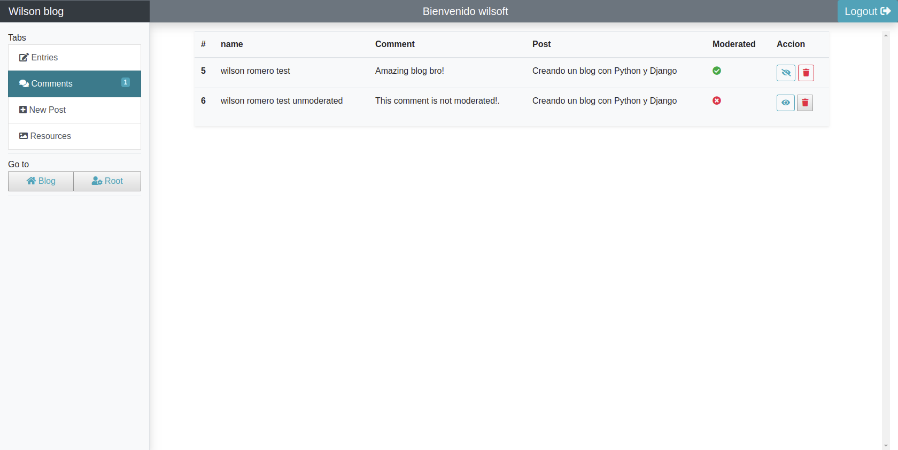
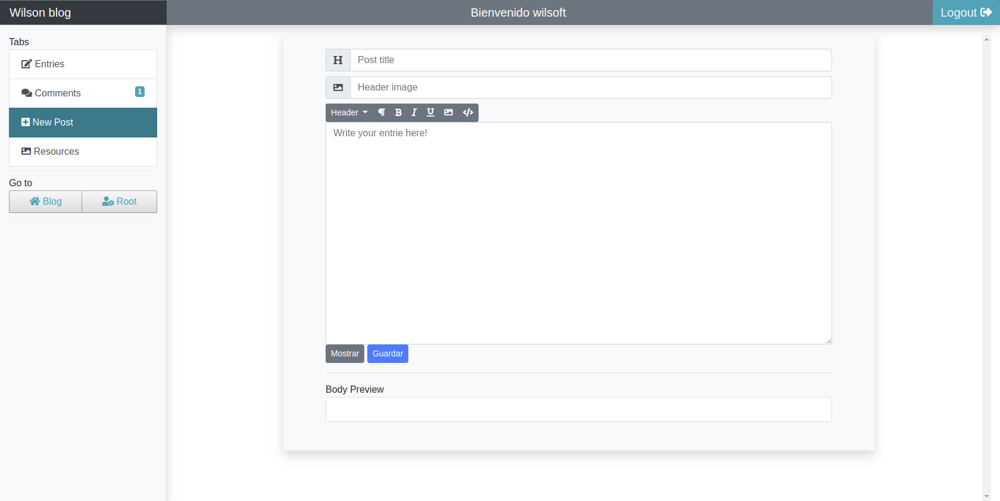
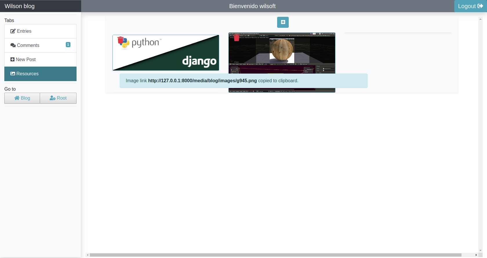

# Django blog system

This is a personal project I started to learn new stuff using django. The blog works at it should and currently is deployed as [a heroku app](https://wilsonblog.herokuapp.com) heroku app</a>. The blog has some basic SEO options to share with FB, python and other social media is in progress.

On the blog admin pannel you can create, edit and delete posts, comments and images. On the django admin you can create a new user and it has a model to upload user information, like profile picture, biographi and personal quote that will be displayed on the blog when the user create a entry.

## Pictures

#### Blog view without loged user

#### Loggin form

#### Blog with a user logged in

#### Post view

#### Custom Admin view and entries

#### Comments moderation view

#### Add new post view

#### Upload images form

#### Django admin pannel

